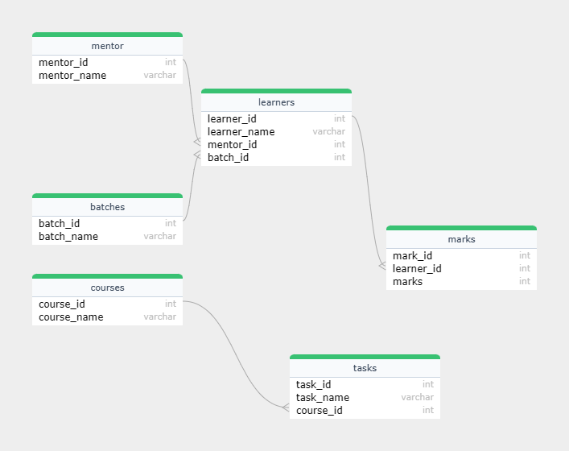

#### Designing DB Model In Mysql

##### We have to create table using this code

// Table for mentor

`CREATE TABLE mentor(
mentor_id INT PRIMARY KEY ,
mentor_name VARCHAR(50));`

// Table for batches

`CREATE TABLE batches(
batch_id INT PRIMARY KEY,
batch_name VARCHAR(50));`

// Table for learners

`CREATE TABLE learners(
learner_id INT PRIMARY KEY,
learner_name VARCHAR(50),
mentor_id INT,
batch_id INT,
FOREIGN KEY(mentor_id) REFERENCES mentor(mentor_id),
FOREIGN KEY(batch_id) REFERENCES batches(batch_id));`

// Table for marks

`CREATE TABLE marks(
mark_id INT PRIMARY KEY,
learner_id INT,
marks INT,
FOREIGN KEY (learner_id) REFERENCES learners (learner_id) );`

// Table for courses

`CREATE TABLE courses(
course_id INT PRIMARY KEY,
course_name VARCHAR(50));`

// Table for tasks

`CREATE TABLE tasks(
task_id INT PRIMARY KEY,
task_name VARCHAR(50),
course_id INT ,
FOREIGN KEY(course_id) REFERENCES courses(course_id));`

#### ERR Diagram of The Above Table

